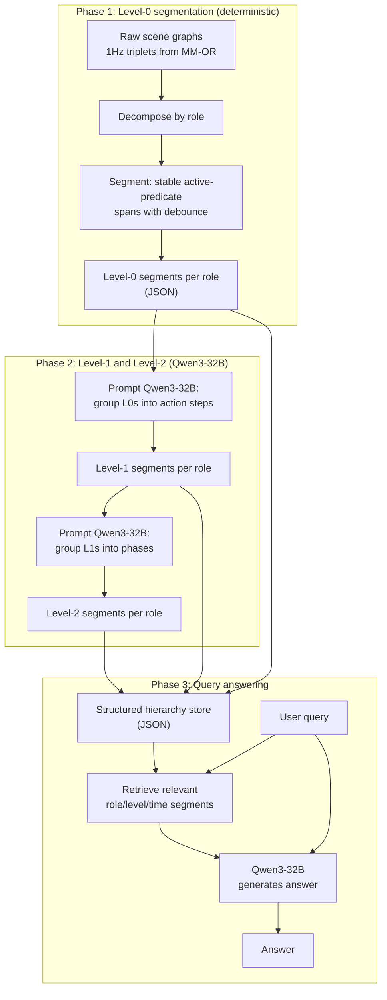

# Role-Aware Hierarchical Scene Summarization

## Overview

Build a role-aware hierarchical surgical scene summarization system:
1. Generate level-0 segments deterministically
2. Use Qwen3-32B to produce level-1 and level-2 groupings/summaries per role
3. Build a retrieval + Qwen3-32B query-answering system over the hierarchy

## Progress

- [x] Extract shared utilities (data loading, entity maps, model loading) into `scene_graph_utils.py`
- [x] Implement level-0 deterministic segmentation per role in `build_hierarchy.py`
- [ ] Design level-1 prompt, run Qwen3-32B grouping on 001_PKA level-0 segments, inspect and iterate
- [ ] Design level-2 prompt, run Qwen3-32B grouping on level-1 segments
- [ ] Build `query_hierarchy.py` with retriever + Qwen3-32B answer generation
- [ ] Extend visualization to show the per-role hierarchy tree

## Architecture




## Phase 1: Level-0 segmentation (DONE)

Level-0 = maximal contiguous span where a role's active predicates stay the same.

**Logic:**
1. Load scene graphs (reuse `load_relation_labels` and `load_frame_map` from `scene_graph_utils.py`)
2. Extract roles present in the data (subjects of triplets: `head_surgeon`, `nurse`, `anest`, `mps`, etc.)
3. For each role, at each timestamp, collect the set of **active** (predicate, object) pairs -- ignore `CloseTo` and `LyingOn` for segmentation
4. Walk timestamps sequentially: while the active set stays the same, extend the current segment. When it changes and the change persists for >= 2 frames (debounce), start a new segment
5. Output: one JSON file per procedure containing all roles' level-0 segments

**Results on 001_PKA (600 frames, t=3386s-5723s):**

| Role | Level-0 segments | Notes |
|------|-----------------|-------|
| Head surgeon | 52 | Rich activity: drilling, cutting, calibrating robot, hammering |
| Scrub nurse | 76 | Most active: frequent instrument handling and prep |
| MPS (robot tech) | 46 | Robot manipulation, instrument handling |
| Assistant surgeon | 24 | Intermittent assisting and patient touching |
| Circulator nurse | 18 | Mostly idle, active late in procedure (C-arm, instruments) |
| Anaesthetist | 1 | No active predicates (only spatial CloseTo) |
| Unrelated person | 1 | No active predicates |

Debounce (2 frames) removes 41% of spurious 1-frame flicker segments (370 → 218).

## Phase 2: Level-1 and Level-2 via Qwen3-32B

**Level-1: Action steps** (30s - 5 min per segment)
- Feed Qwen3-32B a role's full sequence of level-0 segments (IDs, time ranges, active predicates)
- Ask it to group consecutive segments into coherent action steps with a 1-sentence summary per group
- Constrain output to JSON for parseability

**Level-2: Surgical phases** (5 - 20 min per segment)
- Feed Qwen3-32B a role's level-1 segments
- Ask it to group them into surgical phases with a 1-sentence summary per phase
- Allow roles with only 1-2 level-1 segments to have a single level-2 (or no level-2)

Roles have **asymmetric depth**: the surgeon may have 3 full levels, while the anaesthetist may only have 1-2.

## Phase 3: Query-answering system

Create `query_hierarchy.py` -- a retrieval + Qwen3-32B QA system.

**Components:**
1. **Hierarchy loader** -- reads the JSON store produced by phases 1-2
2. **Retriever** -- given a query, selects relevant segments:
   - Parse query for role mentions, time expressions, granularity keywords
   - Map granularity: "detail"/"exactly" → level-0, "step"/"task" → level-1, "phase"/"summary"/"overview" → level-2
   - Filter segments by role + time range + level
   - For cross-role queries ("interaction between nurse and surgeon"), retrieve from both roles at the same level
3. **Answer generator** -- format retrieved segments as context, pass to Qwen3-32B with the query, return the answer

**Example queries:**
- "What did the head surgeon do in the first 15 minutes?"
- "Describe the nurse's activity in detail at t=1200"
- "What were the interactions between the MPS technician and the surgeon?"
- "Give me a high-level summary of the procedure"

## File structure (target)

```
dlhm/
  scene_graph_utils.py        # shared utilities
  annotation_model.py         # flat 5s window annotations (baseline)
  build_hierarchy.py          # phase 1 (level-0) + phase 2 (level-1, level-2)
  query_hierarchy.py          # phase 3 (retrieval + QA)
  evaluate_annotations.py     # quality checks
  visualize_annotations.py    # HTML report
  render_summary_video.py     # sync video viewer
  hierarchy_output/
    001_PKA_hierarchy.json    # full hierarchy for procedure 001_PKA
  annotation_output/          # flat annotation outputs
  script/
    run.sh                    # interactive run
    annotate_slurm.sh         # Slurm batch script
```
